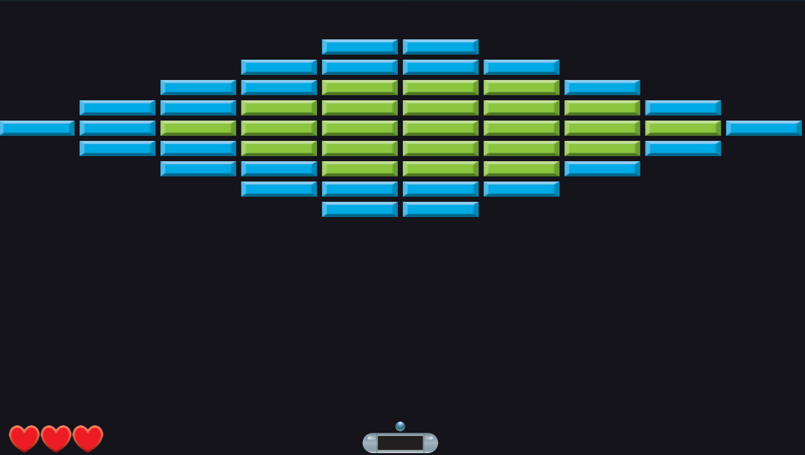
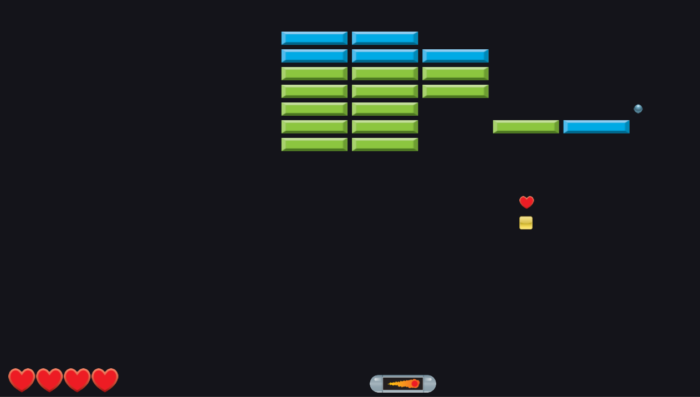

# Breakout Game - OpenGL Renderer

A 2D Breakout game built with **SDL3** and **OpenGL**.

<p align="center">
  
  
</p>

## Features

- **10 Levels** with unique brick patterns
- **Power Up System**: Powerups drop randomly from destroyed bricks
  - Widen Paddle: Increase paddle width temporarily
  - Slow Ball: Reduce ball speed temporarily
  - Multi-Ball: Clones the ball two times 
  - Piercing Ball: Ball passes through bricks without bouncing
  - Extra Lives: Gain an additional life
- **Custom Level Support**: Creation of custom levels with 9 different brick colors
- **Audio System**: 
  - Sound effects for brick breaks, life loss, level completion and powerups
  - Latest sound overrides brick break and powerups sound to prevent sound queuing

- **Settings Persistence**: 
  - Saves and loads preferences (paddle speed, graphics mode (normal, gradient, texture) , etc).
  - Storage of save file: `bin/settings.json`
- **Information HUD**: FPS counter, lives display, active powerup timer
- **Control and game behavior**: Paddle movement and ball/brick/wall collision
- **UI**: ImGui for menus and in-game information
 
## How to Play

**Controls**:
- **Left/Right Arrow Keys** or **A/D**: Move paddle
- **Space Bar** or **Left Mouse Click**: Release ball from paddle
- **ESC**: Open/close pause menu

**Objective**:
- Destroy all bricks on each level to get to the next level
- Avoid losing all lives (live is lost when the is no caught) 

## Custom Levels

1. Create a `.txt` file in the `../levels/` directory with a valid level layout
2. Launch the game
3. Select "Custom Levels" from the main menu
4. Choose a custom level and play

**Format**: 
- 11 rows × 10 columns
- `0` = Empty space (no brick)
- `1-9` = Brick colors (1=Blue, 2=Light Green, 3=Purple, 4=Red, 5=Orange, 6=Light Blue, 7=Yellow, 8=Green, 9=Brown)

**Example Level**:
```
1111111111
2222222222
3333333333
4444444444
5555555555
0000000000
0000000000
0000000000
0000000000
0000000000
0000000000
```